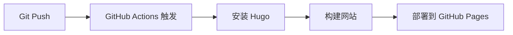

# Tt200411's Personal Website

<p align="center">
    <b>个人技术博客网站 - 基于 Hugo Hinode 主题</b>
    <br />
    <em>涵盖深度学习、优化算法、振荡器理论等技术内容</em>
</p>

<p align="center">
    <a href="https://tt200411.github.io">
        
    </a>
    <a href="https://tttang2004.cn">
        
    </a>
    <a href="https://gohugo.io">
        
    </a>
    <a href="https://github.com/gethinode/hinode">
        
    </a>
</p>

## 📖 目录

- [项目概述](#项目概述)
- [文件结构说明](#文件结构说明)
- [部署流程](#部署流程)
- [GitHub Actions](#github-actions)
- [本地开发环境](#本地开发环境)
- [内容管理](#内容管理)
- [配置说明](#配置说明)

## 🌟 项目概述

这是 Tt200411 的个人技术网站，使用 Hugo 静态网站生成器和 Hinode 主题构建。网站包含以下技术领域的内容：

- **Oscillator** - 振荡器理论与可视化
- **Deep Learning** - 深度学习算法与架构
- **Optimization** - 优化算法与方法

**访问地址:**
- 主站: https://tt200411.github.io
- 自定义域名: https://tttang2004.cn

## 📁 文件结构说明

```
Tt200411.github.io/
├── .github/
│   └── workflows/
│       └── hugo.yml              # GitHub Actions 自动部署配置
├── archetypes/                   # Hugo 内容模板
├── assets/                       # 静态资源（图片、JS、CSS）
│   ├── img/                     # 图片资源
│   ├── js/                      # JavaScript 文件
│   └── scss/                    # SCSS 样式文件
├── component-library/            # Bookshop 组件库
├── config/                       # 网站配置目录
│   └── _default/
│       ├── hugo.toml            # Hugo 主配置文件
│       ├── params.toml          # 主题参数配置
│       ├── languages.toml       # 多语言配置
│       ├── markup.toml          # 内容渲染配置
│       └── menus/
│           └── menus.en.toml    # 导航菜单配置
├── content/                      # 网站内容目录
│   ├── _index.md                # 首页内容
│   ├── oscillator/              # 振荡器专题
│   │   ├── _index.md
│   │   └── oscillator-visualization.md
│   ├── deep-learning/           # 深度学习专题
│   │   ├── _index.md
│   │   ├── neural-network-fundamentals.md
│   │   ├── convolutional-neural-networks.md
│   │   └── transformer-architecture.md
│   └── optimization/            # 优化算法专题
│       ├── _index.md
│       ├── gradient-descent-methods.md
│       ├── convex-optimization.md
│       └── metaheuristic-algorithms.md
├── data/                         # 数据文件和结构定义
├── exampleSite/                  # 主题示例站点
├── i18n/                        # 国际化翻译文件
├── layouts/                      # HTML 模板文件
├── static/                       # 静态文件（直接复制到输出）
│   ├── .nojekyll                # 禁用 Jekyll 处理
│   ├── fonts/                   # 字体文件
│   ├── img/                     # 静态图片
│   └── js/                      # 静态 JavaScript
├── go.mod                        # Go 模块定义
├── go.sum                        # Go 模块校验和
├── hugo_stats.json              # Hugo 构建统计
├── netlify.toml                 # Netlify 部署配置
├── package.json                 # Node.js 依赖配置
├── package-lock.json            # Node.js 依赖锁定文件
└── theme.toml                   # 主题信息文件
```

### 🔧 核心配置文件

| 文件 | 作用 |
|------|------|
| `config/_default/hugo.toml` | Hugo 主配置：网站标题、URL、构建设置 |
| `config/_default/params.toml` | 主题参数：样式、功能开关、SEO 设置 |
| `config/_default/menus/menus.en.toml` | 导航菜单配置 |
| `.github/workflows/hugo.yml` | GitHub Actions 自动部署流程 |
| `static/.nojekyll` | 告诉 GitHub Pages 不使用 Jekyll |

## 🚀 部署流程

### 1. 开发阶段


### 2. 自动部署阶段


### 完整部署流程：

1. **本地开发**: 使用 `hugo server` 在本地预览
2. **提交代码**: `git add . && git commit -m "message" && git push`
3. **自动构建**: GitHub Actions 自动触发构建流程
4. **网站更新**: 构建完成后自动部署到 GitHub Pages

## ⚙️ GitHub Actions 编译过程

我们的 GitHub Actions 配置文件 `.github/workflows/hugo.yml` 实现了完全自动化的部署流程：

### 触发条件
- Push 到 `main` 分支
- 手动触发 (`workflow_dispatch`)

### 构建作业 (Build Job)
```yaml
步骤详解:
1. 安装 Hugo CLI (v0.146.0 extended)
2. 安装 Dart Sass 编译器
3. 检出代码仓库 (包含子模块)
4. 配置 GitHub Pages 设置
5. 安装 Node.js 依赖 (如存在)
6. Hugo 构建 (生产模式，启用压缩)
7. 上传构建产物到 GitHub Pages
```

### 部署作业 (Deploy Job)
```yaml
步骤详解:
1. 等待构建作业完成
2. 部署到 GitHub Pages 环境
3. 获取部署后的网站 URL
```

### 构建命令解析
```bash
hugo --gc --minify --baseURL "${{ steps.pages.outputs.base_url }}/"
```
- `--gc`: 垃圾收集，清理无用文件
- `--minify`: 压缩 HTML、CSS、JS
- `--baseURL`: 动态设置基础 URL

## 💻 本地开发环境

### 系统要求
- [Hugo Extended](https://gohugo.io/installation/) v0.146.0+
- [Node.js](https://nodejs.org/) (可选，用于依赖管理)
- [Git](https://git-scm.com/)

### macOS 安装 Hugo
```bash
# 使用 Homebrew
brew install hugo

# 验证安装
hugo version
```

### 启动本地开发服务器
```bash
# 克隆仓库
git clone https://github.com/Tt200411/Tt200411.github.io.git
cd Tt200411.github.io

# 安装依赖 (可选)
npm install

# 启动开发服务器
hugo server --buildDrafts --buildFuture

# 或者使用简化命令
hugo server -D
```

**访问地址**: http://localhost:1313

### 开发模式特性
- 🔥 热重载：文件更改自动刷新浏览器
- 📝 草稿模式：显示 `draft: true` 的文章
- 🚀 快速构建：增量编译，秒级响应

## 📝 内容更新指南

### 博客文章更新流程

#### 1. 创建新博客文章
```bash
# 创建新文章
hugo new blog/your-article-title.md

# 或直接在 content/blog/ 目录创建 .md 文件
```

#### 2. 编写文章内容
```markdown
---
title: "你的文章标题"
description: "文章简短描述"
date: 2025-09-15T10:00:00+08:00
author: "Tt200411"
tags: ["标签1", "标签2"]
categories: ["分类"]
draft: false  # 设为 true 时为草稿，不会发布
featured: true  # 是否在首页显示
---

# 文章正文内容
这里是你的 Markdown 内容...
```

#### 3. 本地预览和测试
```bash
# 启动本地服务器（包含草稿）
hugo server -D

# 访问 http://localhost:1313 预览效果
```

#### 4. 发布到网站
```bash
# 提交更改
git add content/blog/your-article-title.md
git commit -m "新增博客文章: 你的文章标题"
git push origin main

# GitHub Actions 会自动部署，约2-3分钟后生效
```

### 项目更新流程

#### 1. 创建新项目页面
```bash
# 在 content/projects/ 目录创建新项目文件
hugo new projects/your-project-name.md
```

#### 2. 项目页面模板
```markdown
---
title: "项目名称"
description: "项目简短介绍"
date: 2025-09-15
tags: ["技术栈1", "技术栈2"]
categories: ["项目类型"]
github: "https://github.com/username/repo"  # 可选
demo: "https://demo-url.com"  # 可选
image: "/img/project-preview.jpg"  # 项目预览图
draft: false
weight: 10  # 数字越小排序越靠前
---

## 项目介绍
详细描述你的项目...

## 技术栈
- 技术1
- 技术2

## 功能特性
- 功能1
- 功能2

## 截图展示

```

#### 3. 更新项目列表导航
编辑 `config/_default/menus/menus.en.toml`:
```toml
[[main]]
  name = "新项目名称"
  pageRef = "/projects/your-project-name/"
  parent = "Projects"
  weight = 30
```

#### 4. 提交和发布
```bash
git add content/projects/your-project-name.md
git add config/_default/menus/menus.en.toml
git commit -m "新增项目: 项目名称"
git push origin main
```

### 样式和排版调整

#### 1. 全局样式调整
编辑 `assets/scss/common/_styles.scss`:
```scss
// 自定义样式示例
.custom-class {
    margin-top: 2rem;
    padding: 1rem;
    background-color: #f8f9fa;
}

// Hero 区域样式（已配置）
.hero, 
section.hero {
    margin-top: 5rem !important;
    padding-top: 2rem !important;
}
```

#### 2. 主题色彩调整
编辑 `config/_default/params.toml`:
```toml
[style]
    primary = "#4a90e2"      # 主色调
    secondary = "#6c757d"    # 次要色
    light = "#f0f6ff"        # 浅色背景
    dark = "#212529"         # 深色
```

#### 3. 组件级样式调整
如需调整特定页面组件样式，可以：
- 修改对应的 `.scss` 文件
- 在 `assets/scss/components/` 目录找到相应组件样式
- 或在 `_styles.scss` 中添加覆盖样式

#### 4. 字体和布局调整
```toml
# config/_default/params.toml
[main.padding]
    x = 4  # 水平内边距
    y = 4  # 垂直内边距

[navigation]
    logo-height = 70  # Logo高度
    logo-width = 70   # Logo宽度
```

### 常用操作快速参考

#### 上传图片资源
```bash
# 将图片放到以下目录：
static/img/           # 静态图片
assets/img/           # 需要处理的图片
```

#### 更新网站配置
```bash
# 主要配置文件：
config/_default/hugo.toml        # 网站基本信息
config/_default/params.toml      # 主题参数
config/_default/menus/menus.en.toml  # 导航菜单
```

#### 检查网站状态
```bash
# 本地构建测试
hugo --gc --minify

# 检查链接有效性
hugo server --printI18nWarnings --printMemoryUsage --printPathWarnings
```

**重要提醒**: 
- 每次修改后都要通过 `git push` 提交到 GitHub
- GitHub Actions 会自动构建和部署，通常需要2-3分钟
- 可以在 GitHub 的 Actions 标签查看部署状态
- 如有构建错误，检查 Actions 日志进行调试

## ✏️ 内容管理

### 创建新文章
```bash
# 在指定目录创建新文章
hugo new deep-learning/new-article.md
hugo new optimization/new-method.md
hugo new oscillator/new-visualization.md
```

### 文章前置参数 (Front Matter)
```yaml
---
title: "文章标题"
description: "文章描述"
date: 2025-09-15
author: "Tt200411"
tags: ["tag1", "tag2"]
categories: ["分类1", "分类2"]
draft: false
---
```

### 支持的内容类型
- **Markdown**: 标准 Markdown 语法
- **Hugo Shortcodes**: 特殊功能组件
- **数学公式**: KaTeX 数学渲染
- **代码高亮**: Syntax highlighting
- **图片处理**: 自动优化和响应式

## ⚡ 配置说明

### 网站基本信息
```toml
# config/_default/hugo.toml
title = "Tt200411's Personal Website"
baseURL = "https://tt200411.github.io/"
languageCode = "en-us"
```

### 主题参数
```toml
# config/_default/params.toml
[main]
    description = "个人技术博客描述"
    
[navigation]
    logo = "/img/logo_icon.svg"
    fixed = true
    
[sharing]
    enabled = true
```

### 菜单配置
```toml
# config/_default/menus/menus.en.toml
[[main]]
  name = "Deep Learning"
  pageRef = "/deep-learning/"
  weight = 20

[[main]]
  name = "Neural Networks"
  pageRef = "/deep-learning/neural-network-fundamentals/"
  parent = "Deep Learning"
  weight = 1
```

## 🌐 网站特性

- ✅ **响应式设计**: 移动端友好
- ✅ **SEO 优化**: Meta 标签、结构化数据
- ✅ **快速搜索**: FlexSearch 全文搜索
- ✅ **语法高亮**: 代码块美化显示
- ✅ **数学支持**: KaTeX 数学公式渲染
- ✅ **图片优化**: 自动压缩和格式转换
- ✅ **深色模式**: 自动/手动切换
- ✅ **社交分享**: 内置分享按钮
- ✅ **评论系统**: 支持多种评论插件

## 📄 许可证

本项目基于 MIT 许可证开源。Hugo Hinode 主题遵循其原始许可证条款。

## 🔗 相关链接

- [网站首页](https://tt200411.github.io)
- [Hugo 官方文档](https://gohugo.io/documentation/)
- [Hinode 主题文档](https://gethinode.com)
- [Bootstrap 5 文档](https://getbootstrap.com)